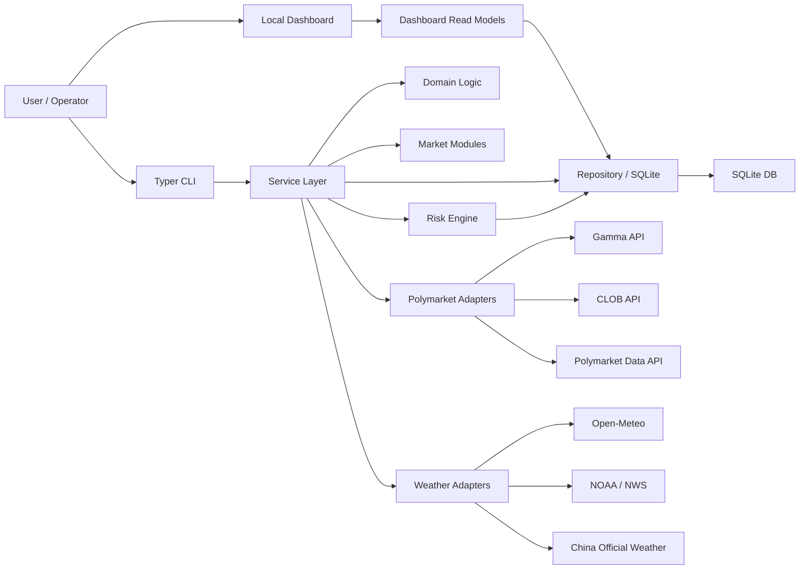
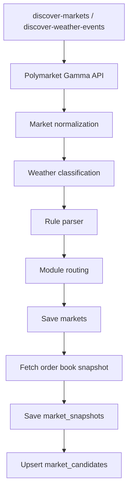
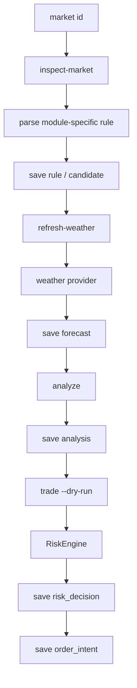
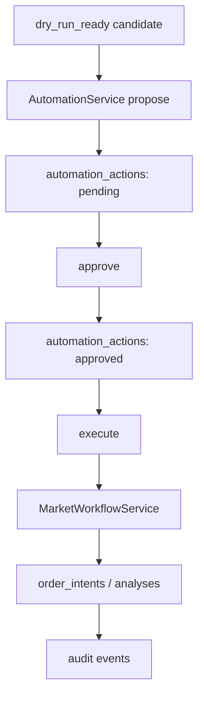
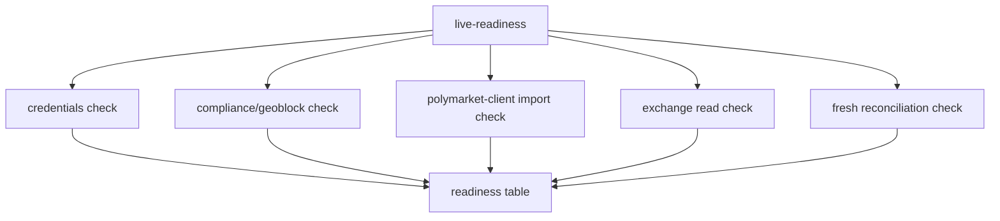
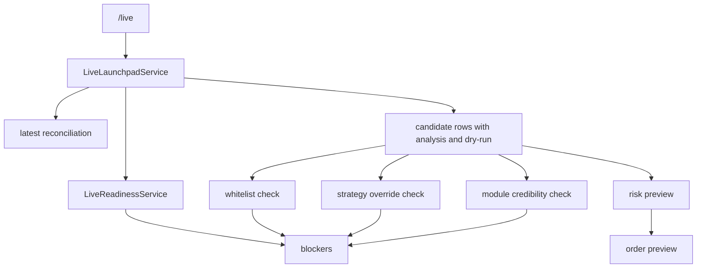
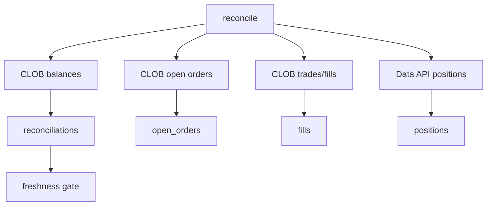

# Polymarket Weather Arb 架构交接文档

本文档写给后续接手本项目的 Claude Code、OpenCode、Cursor、Codex 或人工维护者。目标不是替代 `README.md`，而是把系统边界、数据流、风控门、模块成熟度、后续设计方向一次性讲清楚，避免后来者只看局部文件就误改真实交易路径。

最后更新：2026-06-03

## 1. 项目定位

`polymarket-weather-arb` 是一个 CLI-first 的 Polymarket 天气市场研究与交易自动化项目。它的核心任务是：

1. 从 Polymarket 发现天气相关市场。
2. 解析市场标题和描述里的结算规则。
3. 拉取天气预报或官方观测数据。
4. 估算保守概率区间。
5. 对比 order book 价格，找出潜在 mispricing。
6. 经过风险引擎和 live readiness gates 后，生成 dry-run 或 live limit order intent。
7. 将发现、分析、风险判断、订单意图、交易所同步结果全部落到 SQLite。

项目的安全模型是“先研究和 dry-run，再谨慎 micro-live”。浏览器 UI 可以让用户理解和预览，但不应成为绕过 CLI 风控和人工确认的捷径。

## 2. 当前生产状态

当前系统已经可以进入“研究、dry-run、live readiness 检查、手工 smoke-live 测试、micro-live 预览”的阶段，但不能被视为完全无人值守生产交易系统。特别是 **`/app` 的 Full Live 仍处于锁定状态**，手工的 `operator smoke-live` 只是受控的运维测试命令，这绝对不等于自动化实盘已经成熟。

已完成能力：

- CLI 命令体系已经拆成 root commands 与 command groups。
- 本地 dashboard 已有 beginner cockpit、live launchpad、market workflow 页面。
- 支持标准天气阈值市场、国内城市温度桶市场、全球温度桶 dry-run、雨雪 dry-run、风暴研究分类。
- SQLite schema 已覆盖 markets、rules、forecasts、analyses、risk decisions、order intents、open orders、fills、positions、automation actions。
- live readiness 已检查 credentials、compliance、CLOB SDK、exchange reads、fresh reconciliation。
- live launchpad 已能显示 readiness、候选市场、whitelist、override、模块可信度、订单预览。
- 风控硬上限仍然有效：25 USDC/order、100 USDC/day、50 USDC/market，profile 和 override 只能收紧，不能放松。
- `micro-live` profile 已将默认 live 尺寸压到 5/10/5 USDC。

必须继续保持的限制：

- 如果 geoblock/compliance 显示当前国家不在允许列表，不能真实下单。
- 用户曾经在本地看到 `country=SG blocked`，这不是全绿。必须在 HK 节点或合规允许环境下重新跑 `live-readiness` 并确认 compliance 为 allowed。
- 新增的 `global_temp_bucket`、`precip_snow` 当前是 dry-run-only。
- `hurricane_storm` 当前是 research-only。
- 浏览器页面 `/app` 不执行 live order，只做解释、预览和 pending action 显示。**Full Live 模式必须保持锁定**，直到全套风控、资金上限和退出熔断器达到生产级标准。

## 3. 高层架构图



关键设计原则：

- `domain/` 尽量保持纯业务逻辑，不直接做 I/O。
- `adapters/` 负责外部 API，背后用 Protocol 保持可测试性。
- `services/` 负责编排：发现、分析、交易、对账、自动化、live launchpad。
- `storage/` 是 SQLite schema 和 repository facade。
- `dashboard.py` 和 `dashboard_ui/` 是本地只读或低风险操作界面。
- `modules/` 是天气市场类型扩展点，但目前 workflow 仍有一些模块分支写在 `MarketWorkflowService` 里。

## 4. Runtime Surfaces

### 4.1 CLI

入口文件：

- `src/polymarket_weather_arb/cli.py`
- `src/polymarket_weather_arb/cli_commands/*.py`

主要命令：

- `init-db`：初始化 SQLite schema。
- `doctor`：基础配置健康检查。
- `doctor --live`：检查 live credentials。
- `backup-db`：在线 SQLite 备份。
- `dashboard`：启动本地 HTTP dashboard。
- `live-readiness`：真实交易前 readiness 表格。
- `discover-markets`：通过 Gamma API 搜天气市场。
- `discover-weather-events`：从 Polymarket weather 页面发现事件 slug 再取 markets。
- `markets`：列出本地 markets。
- `candidates`：列出候选市场。
- `candidate-mark`：人工标记候选状态。
- `inspect-market`：解析单个市场规则。
- `refresh-weather`：刷新天气数据。
- `analyze`：分析 fair probability 和 edge。
- `trade --dry-run`：生成 dry-run order intent。
- `trade`：尝试 live order，但会走所有 live gates。
- `orders`：查看 order intents。
- `reconcile`：读取 CLOB/open orders/fills/positions 并写入本地。
- `risk-report`：查看本地风险敞口。

Command groups：

- `operator`：半自动化控制台、daemon、queue、overrides、exchange state、`smoke-live`（受控的小额真实限价单测试）。
- `profiles`：策略 profile。
- `fixtures`：fixture 导入和离线 demo。
- `automation`：action queue approve/execute 等。

后续工具要新增命令时，优先放到 `cli_commands/` 中，再在 `cli.py` 注册，不要把 `cli.py` 重新变成巨型文件。

### 4.2 Dashboard

入口：

- `src/polymarket_weather_arb/dashboard.py`
- `src/polymarket_weather_arb/dashboard_ui/`

特点：

- 使用 Python stdlib HTTP server，没有额外前端构建链。
- 默认绑定 `127.0.0.1`。
- 支持中英文 i18n，`?lang=zh` 可切中文。
- 设计目标是 operator cockpit，不是营销网页。

主要页面：

- `/`：overview。
- `/beginner`：小白驾驶舱，安全演练、设置清单、最近结果。
- `/live`：Live Launchpad，集中展示 readiness、候选市场、preview、blockers。
- `/markets`、`/markets/<id>`：市场列表与单市场 workflow。
- `/actions`：automation queue。
- `/open-orders`、`/positions`、`/fills`：交易所同步状态。
- `/overrides`：策略 override。
- `/runs`：命令运行记录。

重要限制：

- 浏览器页面可以解释和预览。
- 浏览器页面不应直接 approve 或 execute live order。**Full Live 的入口在 `/app` 中处于硬锁定状态**。
- live execution 仍应由 CLI/daemon 中的 allowlisted automation executor 执行。
- 手工的 `operator smoke-live` 只是用于验证新官方 `polymarket-client` 和 API 连通性的受控命令，不等同于自动化实盘的成熟。

### 4.3 Operator Daemon

入口：

- `src/polymarket_weather_arb/services/operator_daemon.py`
- CLI group: `operator daemon`

能力：

- 每个 tick 可做 discovery。
- 可 propose action。
- 可自动执行 dry-run。
- 可包含 reconciliation。
- 可发 dashboard/Discord 通知。
- 可在极其明确的 gates 下执行 micro-live。

live auto 必须满足：

- profile 是 `micro-live`。
- 显式传 `--allow-live-auto`。
- 显式传 `--allow-profile-kind`。
- market 在 `--live-market` 或 `LIVE_MARKET_IDS` whitelist。
- fresh successful reconciliation。
- risk guard status `ok`。
- 默认不允许已有 nonzero positions。
- strategy override 中 `live_auto_enabled=True`。
- module live eligibility 允许。
- forecast source 为 settlement-grade。
- hard risk caps 通过。

## 5. Package Map

### 5.1 `config.py`

`Settings` 使用 `pydantic-settings` 从 `.env` 读取配置。

关键 env：

- `DATABASE_PATH`
- `POLYMARKET_GAMMA_API_BASE`
- `POLYMARKET_CLOB_API_BASE`
- `POLYMARKET_DATA_API_BASE`
- `POLYMARKET_PRIVATE_KEY` (Live trading 使用新官方 `polymarket-client` 进行限价单签名)
- `POLYMARKET_FUNDER` (Live trading 时作为 `wallet` 地址传给 `polymarket-client`，用于鉴权和持仓同步)
- `WEATHER_PROVIDER`
- `GOOGLE_WEATHER_API_KEY`
- `CHINA_WEATHER_*_URL`
- `CHINA_WEATHER_OPEN_METEO_FALLBACK`
- `MAX_ORDER_USDC`
- `MAX_DAILY_USDC`
- `MAX_MARKET_USDC`
- `MIN_EDGE`
- `SLIPPAGE_BUFFER`
- `STALE_ORDER_BOOK_SECONDS`
- `STALE_FORECAST_SECONDS`
- `LIVE_MARKET_IDS`
- `TRADING_DISABLED`
- `COMPLIANCE_CHECK_ENABLED`
- `COMPLIANCE_ALLOWED_COUNTRIES`
- `POLYMARKET_GEOBLOCK_API_URL`

注意：

- `ensure_live_trading_ready()` 只检查 live credentials，不代表 compliance 通过。
- `TRADING_DISABLED=true` 是本地 kill switch。
- `COMPLIANCE_ALLOWED_COUNTRIES` 默认是 `HK`。

### 5.2 `domain/`

纯业务模型和算法，尽量不依赖网络或数据库。

主要文件：

- `markets.py`：`Market`、`MarketSnapshot`，从 Gamma payload 归一化市场对象，判断是否 weather。
- `rules.py`：标准天气 threshold rule 解析，例如最高温、最低温、降雨、降雪。
- `probability.py`：概率分布辅助函数。
- `pricing.py`：`Analysis` 和保守概率区间分析。
- `risk.py`：`RiskEngine`、`ProposedOrder`、`RiskContext`、硬编码风险上限。
- `execution.py`：从 analysis 构造 proposed order。
- `weather.py`：`ForecastSnapshot` 和天气值归一化。
- `china_temperature_bucket.py`：国内城市温度桶规则解析。
- `china_bucket_pricing.py`：国内温度桶价格分析。
- `global_temperature_bucket.py`：全球温度桶规则解析。
- `global_bucket_pricing.py`：全球温度桶价格分析。
- `hurricane_storm.py`：风暴/飓风市场研究分类。

维护建议：

- 新 settlement parser 应先在 `domain/` 里独立实现和测试。
- Parser 不应偷偷做 I/O。
- 对不确定规则要返回 needs_review/rejected，不要硬猜。

### 5.3 `adapters/`

外部 API 适配层。

Polymarket：

- `adapters/polymarket/base.py`：client Protocol。
- `adapters/polymarket/client.py`：Gamma API、CLOB API、Data API 读写。
- `adapters/polymarket/translator.py`：market/token translation。

Weather：

- `adapters/weather/base.py`：WeatherProvider Protocol。
- `adapters/weather/open_meteo.py`：Open-Meteo forecast。
- `adapters/weather/noaa.py`：NOAA/NWS provider。
- `adapters/weather/china_official.py`：中国官方天气站点和 Open-Meteo fallback。

维护建议：

- 外部 API shape 容易漂移，新增字段解析要配 fixture 或 mocked HTTP tests。
- Live trading 相关 adapter 失败时必须 fail closed。
- Open-Meteo 这类非结算源可以用于 research/dry-run，不应直接用于 live。

### 5.4 `services/`

编排层，是项目复杂度最高的部分。

主要服务：

- `discovery_service.py`：发现标准 weather markets，解析规则，保存 market/snapshot/candidate。
- `china_bucket_discovery_service.py`：发现中国温度桶市场。
- `analysis_service.py`：标准 weather rule 的 forecast + probability analysis。
- `market_workflow_service.py`：单市场 inspect/refresh/analyze/research/trade workflow。
- `module_workflows.py`：模块 workflow adaptor/protocol 边界。
- `module_credibility_service.py`：模块可信度快照，决定 live eligibility。
- `trading_service.py`：risk gates + order intent + live/dry-run submission。
- `automation_service.py`：pending/approve/execute action queue。
- `operator_daemon.py`：连续 tick 自动化。
- `live_monitor_service.py`：live gate snapshot。
- `live_readiness_service.py`：credentials/compliance/sdk/exchange/reconciliation readiness。
- `live_launchpad_service.py`：Live Launchpad read model 和订单 preview。
- `reconciliation_service.py`：open orders、fills、positions 对账。
- `order_lifecycle_service.py`：订单生命周期辅助。
- `backup_service.py`：SQLite 在线备份。
- `fixture_service.py`：fixture 导入和 demo 数据。
- `cockpit_service.py`：beginner cockpit read model。
- `compliance_service.py`：Polymarket geoblock/compliance check。

维护建议：

- `services/` 可以做 I/O 编排，但不要把 parser 算法塞进去。
- `MarketWorkflowService` 目前还有 `china_temp_bucket` 和 `global_temp_bucket` 分支，后续可拆成 per-module workflow classes。
- `LiveLaunchpadService` 是 read model，不应该放真实执行逻辑。

### 5.5 `modules/`

模块注册系统。

入口：

- `modules/base.py`
- `modules/registry.py`

当前模块：

| Module ID | 当前能力 | Live Eligibility |
| --- | --- | --- |
| `weather` | 标准温度 threshold，支持 discovery/analysis/dry-run/live gates | `candidate_gate_required` |
| `china_temp_bucket` | 国内城市温度桶，支持 discovery/analysis/dry-run/live gates | `candidate_gate_required` |
| `global_temp_bucket` | 全球温度桶 discovery/analysis/dry-run/micro-live | `micro_live_ready` |
| `precip_snow` | 降雨/降雪 threshold 归类和 dry-run | `dry_run_only` |
| `hurricane_storm` | 风暴/飓风研究分类 | `research_only` |

模块成熟度由 `module_credibility_service.py` 决定：

- `hurricane_storm` 永远 research-only，直到有 NHC/官方源、解析器和模型。
- `global_temp_bucket` 已接入 Autopilot 的批量预测、Edge 排序和 micro-live；
  NOAA 无法解析城市时保留真实 `research_forecast` 标签并回退 Open-Meteo。
- `precip_snow` 仍为 dry-run-only。
- `weather` 和 `china_temp_bucket` 可进入候选 live gate，但仍需要 whitelist、override、fresh reconciliation、settlement-grade source 等全部通过。

新增模块时的最低步骤：

1. 在 `domain/` 写 parser/model/pricing。
2. 在 `modules/` 新建模块定义。
3. 在 `modules/registry.py` 注册。
4. 在 discovery 中路由到 `module_id`。
5. 在 workflow 中接入 inspect/refresh/analyze/dry-run。
6. 在 repository/schema 中保存必要 rule。
7. 在 `module_credibility_service.py` 明确 live eligibility。
8. 在 dashboard/live launchpad 显示模块可信度。
9. 写测试覆盖 parser、discovery routing、workflow、dashboard read model。
10. 默认先 `research_only` 或 `dry_run_only`，有足够证据后再升到 live candidate。

### 5.6 `storage/`

SQLite 是项目事实源。

入口：

- `storage/db.py`
- `storage/repositories.py`
- `storage/repository_automation.py`

主要表：

- `runs`：CLI/automation run 记录。
- `reconciliations`：对账结果。
- `markets`：市场主体，包含 `module_id`。
- `market_snapshots`：order book snapshot。
- `resolution_rules`：标准 threshold rule。
- `market_candidates`：候选状态和人工 review notes。
- `temperature_bucket_rules`：中国和全球温度桶共用 rule 表，包含 `module_id` 和 `unit`。
- `weather_forecasts`：forecast snapshot。
- `weather_observations`：官方观测值。
- `analyses`：fair probability、edge、decision。
- `risk_decisions`：风险引擎判断。
- `order_intents`：dry-run/live order intent。
- `order_attempts`：live order request/response。
- `open_orders`：交易所 open orders 本地快照。
- `fills`：成交记录。
- `positions`：持仓快照。
- `strategy_overrides`：market/profile-specific risk tightening 和 live_auto 开关。
- `automation_actions`：pending/approved/executing/done action queue。
- `automation_audit_events`：action 生命周期审计。

Schema 维护原则：

- 使用 `_migrate_schema()` 做向后兼容迁移。
- 不要删除用户已有 SQLite 数据。
- 新字段要有默认值或迁移逻辑。
- Repository 方法应集中在 `repositories.py` 或 `repository_automation.py`，不要在服务里散写 SQL。

## 6. 核心数据流

### 6.1 Discovery Flow



关键文件：

- `cli.py`
- `services/discovery_service.py`
- `domain/markets.py`
- `domain/rules.py`
- `domain/hurricane_storm.py`
- `storage/repositories.py`

当前 routing：

- `rule.variable in {"precipitation", "snowfall"}` -> `precip_snow`
- storm/hurricane classifier 命中 -> `hurricane_storm`
- 其他标准 weather -> `weather`
- 中国温度桶主要走 `china_bucket_discovery_service.py`
- 全球温度桶目前通过 workflow parser 和 module registry 接入，后续可继续增强 discovery routing。

### 6.2 Single Market Workflow



关键文件：

- `services/market_workflow_service.py`
- `services/analysis_service.py`
- `services/trading_service.py`
- `domain/*pricing.py`
- `domain/risk.py`

注意：

- 没有 market snapshot 时无法 analyze。
- 没有 analysis 时无法 trade。
- `trade --dry-run` 只生成本地 order intent。
- live trade 还要检查 credentials、fresh data、forecast source grade、risk caps 等。

### 6.3 Automation Flow



关键文件：

- `services/automation_service.py`
- `storage/repository_automation.py`
- `cli_commands/operator.py`

设计要点：

- approval 和 execution 分离。
- action 有 TTL。
- 执行命令必须 allowlisted。
- Discord approval 只改变本地 queue，执行仍由本地 CLI 完成。

### 6.4 Live Readiness Flow



关键文件：

- `services/live_readiness_service.py`
- `services/compliance_service.py`
- `services/reconciliation_service.py`

特别提醒：

- 表格必须全部 OK 才可考虑 micro-live。
- `country=SG blocked` 不是合规通过。
- HK VPS 或 HK 节点上也要重新跑，不要复用本地旧结果。

### 6.5 Live Launchpad Flow



关键文件：

- `services/live_launchpad_service.py`
- `dashboard_ui/live.py`
- `services/module_credibility_service.py`

设计要点：

- Launchpad 是解释器和预览器。
- `can_execute` 当前保持 false。
- 用户真正进入 live 仍要用 CLI/daemon，并且全部 gates 重新检查。

### 6.6 Reconciliation Flow



关键文件：

- `services/reconciliation_service.py`
- `adapters/polymarket/client.py`
- `storage/repositories.py`

设计要点：

- Live trading 依赖 fresh successful reconciliation。
- 对账失败或 adapter shape 不支持时不能标记 successful。
- Nonzero positions 默认阻止 daemon live auto。

## 7. 风控和真实交易安全模型

### 7.1 Hard Risk Caps

位于 `domain/risk.py`：

- `HARDCODED_MAX_ORDER_USDC = 25`
- `HARDCODED_MAX_DAILY_USDC = 100`
- `HARDCODED_MAX_MARKET_USDC = 50`

profile 和 strategy override 只能进一步降低风险，不能超过 hard caps。

### 7.2 Profiles

位于 `profiles.py`：

- `balanced`：默认 operator workflow。
- `conservative`：更小尺寸、更高 edge、更短 TTL。
- `research-only`：偏发现和分析。
- `dry-run-demo`：fixture/offline demo。
- `micro-live`：唯一可用于 daemon live auto 的 profile，默认 caps 为 5/order、10/day、5/market，`min_edge=0.10`。

### 7.3 Strategy Overrides

表：`strategy_overrides`

用途：

- 按 market/profile 设置更高 `min_edge`。
- 降低 `max_order_usdc`、`max_daily_usdc`、`max_market_usdc`。
- 显式设置 `live_auto_enabled=True`。

注意：

- 没有 override，live auto 不会开。
- override 不能绕过 hard caps。
- override precedence 是 exact market/profile，然后 wildcard。

### 7.4 Live Trading Gates

真实下单前至少要满足：

1. `TRADING_DISABLED` 不是 true。
2. live credentials 已配置。
3. compliance/geoblock allowed。
4. `polymarket-client` 可 import。
5. exchange reads 成功。
6. latest successful reconciliation 是 fresh。
7. market 在 whitelist。
8. strategy override 开启 `live_auto_enabled=True`。
9. module live eligibility 允许。
10. 最新 forecast 是 settlement-grade。
11. order book 未过期。
12. forecast 未过期。
13. analysis decision 不是 hold/reject。
14. RiskEngine 接受 proposed order。
15. 对 daemon live auto，默认不能有 nonzero positions。

任何一项失败都应 block，不要 silent fallback。

### 7.5 Forecast Source Gate

README 中已经明确：

- Demo fixtures、Open-Meteo style signals、中国 fallback readings 可用于 research、analysis、dry-run。
- live `trade` 会拒绝非 settlement-grade forecast。
- 只有 raw payload 明确 `source_grade=settlement_grade` 或 `official_signal=true` 才能通过 live source gate。

后续维护者不能为了“跑通一单”而去掉这个 gate。

## 8. Weather Module Roadmap

### 8.1 Standard Weather

Module ID：`weather`

当前支持：

- 单地点 threshold。
- 温度高低阈值。
- 通过 generic `ResolutionRule` 和 `AnalysisService` 分析。

风险：

- 标题/描述解析可能随 Polymarket 文案变化而失效。
- 如果 source 不是 settlement-grade，只能 dry-run。

下一步：

- 增加更多 settlement source parser。
- 给不同城市/国家建立官方源 mapping。
- 提高 rule parser 的 explainability。

### 8.2 China Temperature Bucket

Module ID：`china_temp_bucket`

当前支持：

- 国内城市温度桶。
- `temperature_bucket_rules` 保存 bucket center/lower/upper。
- 中国官方天气 provider + fallback。

风险：

- 官方源 URL 需要在 `.env` 配好。
- fallback 不应 live。

下一步：

- 为更多城市补官方站点。
- 对 settlement station 和 market 文案建立更强映射。
- 加 observation/reconciliation style settlement preview。

### 8.3 Global Temperature Bucket

Module ID：`global_temp_bucket`

当前状态：

- 已有 parser 和 pricing。
- 可 inspect/analyze/dry-run。
- Live eligibility 是 `dry_run_only`。

注意：

- 目前复用 `temperature_bucket_rules`，字段名仍是 `bucket_center_c` 等，但新增了 `unit` 支持非摄氏单位。
- 后续可以考虑将字段名改为 unit-neutral，例如 `bucket_center`，但这需要 schema migration 和较多测试。

升 live 前需要：

- 明确每个市场的官方结算源。
- source-grade forecast/observation provider。
- parser coverage。
- dashboard 中展示单位和官方源。
- live-readiness 演练。

### 8.4 Precipitation / Snow

Module ID：`precip_snow`

当前状态：

- discovery routing 可将 `precipitation`、`snowfall` 归入该模块。
- 使用 generic rule/pricing 路径。
- Live eligibility 是 `dry_run_only`。

升 live 前需要：

- 官方 precipitation/snowfall 数据源。
- 单位处理，例如 inch、mm、cm。
- 时间窗口和 accumulation 规则更严格解析。
- NOAA/NWS 或其他官方源适配。
- 专门测试边界值和缺失值。

### 8.5 Hurricane / Storm

Module ID：`hurricane_storm`

当前状态：

- 只做 research classification。
- Live eligibility 是 `research_only`。

升 dry-run 前需要：

- NHC 或对应官方机构 adapter。
- 事件类型模型，例如 named storm、landfall、category、track。
- 结算规则 parser。
- 概率模型，不要用温度 threshold 的模型硬套。

## 9. Live Launchpad 的角色

Live Launchpad 是为了让用户“看懂、敢操作”，但不是为了让浏览器直接真实下单。

它集中显示：

- readiness gates。
- reconciliation fresh/stale。
- open orders / positions / nonzero positions。
- micro-live caps。
- `LIVE_MARKET_IDS` whitelist。
- 候选市场。
- 最近 analysis 和 dry-run。
- module credibility。
- strategy override 状态。
- micro-live order preview。
- blockers。
- pending live action。

代码：

- `services/live_launchpad_service.py`
- `dashboard_ui/live.py`
- `tests/test_live_launchpad_service.py`
- `tests/test_dashboard_live_launchpad.py`

后续优化方向：

- whitelist/override 的操作入口可以更清楚，但仍应避免一键真实交易。
- preview 可展示“为什么买 YES/NO”、“最大亏损”、“需要哪条命令执行”。
- 可以增加 export/copy command，但命令执行仍由 CLI 手动触发。

## 10. Beginner Cockpit 的角色

Beginner cockpit 面向小白用户，目标是降低误操作。

代码：

- `dashboard_ui/beginner.py`
- `services/cockpit_service.py`

它适合：

- 首次运行安全演练。
- 查看设置清单。
- 查看 dry-run 结果。
- 引导到 orders/markets/live 页面。

它不适合：

- 放真实下单按钮。
- 混入太多专业参数。
- 直接修改 `.env` secret。

## 11. 测试体系

测试目录：

- `tests/`

常用命令：

```bash
uv run pytest -q
uv run ruff check src/ tests/
uv run ruff format src/ tests/
```

重要测试类别：

- Parser tests：`test_rules.py`、`test_china_temperature_bucket.py`、`test_global_temperature_bucket.py`
- Pricing tests：`test_probability_pricing.py`、`test_china_bucket_pricing.py`
- Service tests：`test_market_workflow_service.py`、`test_live_launchpad_service.py`、`test_operator_daemon.py`
- Storage tests：`test_db.py`
- Dashboard tests：`test_dashboard*.py`
- Safety tests：`test_risk.py`、`test_trading_service.py`、`test_live_readiness_service.py`
- Module tests：`test_weather_modules.py`、`test_module_credibility_service.py`、`test_hurricane_storm_module.py`

维护原则：

- 新 parser 必须先加 tests。
- 新 live gate 必须有 negative tests。
- 新 dashboard read model 必须测 blockers 和 display data。
- adapter API 变化要用 mocked HTTP 或 fixture 覆盖。
- 不要只跑单测就提交大改，至少最后跑全量 pytest 和 ruff。

## 12. 部署与 HK VPS

部署文档：

- `docs/hk-vps-production-checklist.md`
- `deploy/env/hk-live.example.env`
- `deploy/systemd/`

建议部署流程：

1. 在 VPS clone repo。
2. `uv sync`。
3. 配 `.env`，不要提交 secret。
4. `uv run polymarket-weather init-db`。
5. `uv run polymarket-weather doctor`。
6. `uv run polymarket-weather reconcile`。
7. `uv run polymarket-weather live-readiness`。
8. 确认 compliance 是 HK allowed。
9. 跑 dry-run rehearsal。
10. 只在指定 market 上设置 `LIVE_MARKET_IDS` 和 strategy override。
11. 用 `micro-live` 小额测试。
12. 开 systemd daemon 前先用 `operator daemon --once`。

生产前不要跳过：

- Fresh reconciliation。
- Backup timer。
- Dashboard 只绑定本机或通过安全 tunnel。
- `.env` secret 权限检查。
- GitHub Actions 或本地测试通过。

## 13. 后续设计方向

### 13.1 将 `MarketWorkflowService` 拆成真正的模块 workflow

当前 `MarketWorkflowService` 里存在：

- `if module_id == 'china_temp_bucket'`
- `if module_id == 'global_temp_bucket'`
- generic weather fallback

建议下一阶段抽象：

- `BaseMarketWorkflow`
- `WeatherThresholdWorkflow`
- `ChinaTempBucketWorkflow`
- `GlobalTempBucketWorkflow`
- `PrecipSnowWorkflow`
- `StormResearchWorkflow`

这样新增体育或其他天气模块时，不必继续拉长一个 service 文件。

### 13.2 Schema 归一化

`temperature_bucket_rules` 同时服务 China 和 Global bucket。

短期可以继续使用：

- `module_id`
- `unit`
- `bucket_center_c`
- `bucket_lower_c`
- `bucket_upper_c`

长期建议：

- 改为 unit-neutral 字段，或新增 `bucket_rules` 表。
- 保留 migration，避免破坏已有数据。
- Dashboard 清楚显示单位。

### 13.3 NOAA / Official Source 扩展

真实交易的关键不是“有 forecast”，而是“forecast/observation 与结算源一致”。

下一步建议：

- 为美国市场建立 NOAA/NWS settlement source mapping。
- 为降雨/降雪建立官方 accumulation 数据源。
- Forecast raw payload 写入 `source_grade=settlement_grade` 的条件必须严格。
- 增加 source credibility UI。

### 13.4 Order Lifecycle

当前系统可以记录 open orders、fills、positions。

后续可增强：

- 自动识别 stale open orders。
- Cancel/replace 策略。
- Position exposure dashboard。
- Fill 后重新计算 market cap。
- 每日 PnL / realized risk report。

注意：

- cancel/replace 也必须经过 explicit gates。
- 不要引入 market order。

### 13.5 Sports Module

用户提过后续可能做体育。建议不要直接塞进 weather module。

建议方向：

- 新包或新 module family：`sports_*`。
- 独立 domain model，例如 teams、games、odds、settlement source。
- 独立 adapters，例如 sportsbook odds、official league data。
- 先 research-only，再 dry-run，再 micro-live。

## 14. 给后续 Coding Agent 的工作规范

接手第一步：

```bash
git status --short --branch
uv run pytest -q
uv run ruff check src/ tests/
```

如果工作树有脏文件：

- 不要 reset。
- 不要 checkout 覆盖。
- 先读 diff，判断是否是用户或上一个工具的改动。
- 只改当前任务需要的文件。

提交策略：

- 用户已明确偏好直接提交到 `main`，不需要每次开 PR。
- 但提交前要分批 staging，不要把无关文件混进去。
- 文档改动和代码改动尽量分开 commit。

安全策略：

- 不能为了演示真实下单而绕过 compliance。
- 不能降低 hard risk caps。
- 不能让 browser UI 直接 execute live。
- 不能把 dry-run-only module 改成 live，除非补齐官方源、测试和用户确认。
- 不能提交 `.env` 或 secret。

开发策略：

- 先读本地模式，再改。
- 业务规则写在 `domain/`。
- 外部 API 写在 `adapters/`。
- 编排写在 `services/`。
- 页面 read model 尽量写 service，dashboard 只渲染。
- SQL 走 repository。
- 新模块先写 tests。

## 15. 常见任务入口

### 想优化 live 页面

看：

- `services/live_launchpad_service.py`
- `dashboard_ui/live.py`
- `tests/test_live_launchpad_service.py`
- `tests/test_dashboard_live_launchpad.py`

不要碰：

- `trading_service.py` 的 live gates，除非任务明确是风控。

### 想新增天气市场类型

看：

- `modules/base.py`
- `modules/registry.py`
- `domain/rules.py`
- `services/discovery_service.py`
- `services/market_workflow_service.py`
- `services/module_credibility_service.py`
- `tests/test_weather_modules.py`

推荐步骤：

1. Parser。
2. Module registration。
3. Discovery routing。
4. Workflow。
5. Credibility。
6. Dashboard。
7. Tests。

### 想修真实下单

看：

- `services/trading_service.py`
- `domain/risk.py`
- `services/live_readiness_service.py`
- `services/reconciliation_service.py`
- `services/live_monitor_service.py`
- `services/operator_daemon.py`

先跑：

```bash
uv run polymarket-weather live-readiness
uv run polymarket-weather reconcile
uv run polymarket-weather risk-report
```

若 compliance blocked，停止，不要继续改下单逻辑。

### 想优化 deployment

看：

- `docs/hk-vps-production-checklist.md`
- `deploy/env/hk-live.example.env`
- `deploy/systemd/`
- `scripts/rehearse_live_readiness.py`
- `services/backup_service.py`

### 想做 UI 小白化

看：

- `dashboard_ui/beginner.py`
- `dashboard_ui/html.py`
- `dashboard_ui/i18n.py`
- `services/cockpit_service.py`

原则：

- 第一屏应该是可操作 cockpit。
- 不要营销页。
- 不要把 live 按钮做得像普通按钮。
- 中文文案要说明 blockers，但不要鼓励绕过。

## 16. 已知风险与坑

1. Polymarket 文案变化会导致 parser 漏判或误判。
2. Gamma/CLOB/Data API 返回 shape 可能变化。
3. Open-Meteo 不等于官方结算源。
4. 本地合规状态可能和 HK VPS 状态不同，必须现场检查。
5. SQLite 是单文件，适合小规模 bot，但要定期 backup。
6. `MarketWorkflowService` 会继续变胖，新增模块前最好先抽 workflow。
7. Global bucket 目前字段名仍带 `_c`，但 unit 可能不是 C。
8. Storm markets 不能套用温度概率模型。
9. Browser dashboard 是 operator UI，不是交易终端。
10. `LIVE_MARKET_IDS` 是强 gate，别用通配符式逻辑绕开。

## 17. Glossary

- Market：Polymarket 上的一个预测市场。
- Candidate：本地认为值得 review 或 dry-run 的市场。
- Rule：从标题/描述解析出的结算条件。
- Forecast：天气预报或官方数据快照。
- Analysis：模型给出的 fair probability、edge、side、decision。
- Dry-run：只生成本地 order intent，不触达 CLOB 下单。
- Live：真实向 CLOB 提交 limit order。
- Reconciliation：读取交易所 open orders、fills、positions 后写入 SQLite。
- Readiness：真实交易前的 credentials/compliance/sdk/exchange/reconciliation 检查。
- Whitelist：`LIVE_MARKET_IDS` 或 daemon `--live-market` 指定的可 live 市场。
- Override：`strategy_overrides` 中的 market/profile 风控设置。
- Module Credibility：模块规则、数据源、freshness、live eligibility 的综合状态。
- Settlement-grade：足以匹配市场结算源的官方或明确认可数据。

## 18. 最短安全操作路径

小白或后续 agent 想验证系统，不要直接 live。按这个顺序：

```bash
uv sync
uv run polymarket-weather init-db
uv run polymarket-weather doctor
uv run polymarket-weather dashboard --port 8765
uv run polymarket-weather operator demo --profile dry-run-demo
uv run polymarket-weather operator approve-latest --actor local-operator
uv run polymarket-weather operator run-approved --limit 1
uv run polymarket-weather orders
uv run polymarket-weather reconcile
uv run polymarket-weather live-readiness
```

只有当 `live-readiness` 全部 OK，且 compliance 是 allowed，才进入 micro-live：

```bash
uv run polymarket-weather operator override-set \
  --market <market_id> \
  --profile micro-live \
  --min-edge 0.12 \
  --max-order-usdc 3 \
  --live-auto \
  --notes "tiny live test"

uv run polymarket-weather operator daemon --once \
  --profile micro-live \
  --allow-profile-kind \
  --allow-live-auto \
  --live-market <market_id> \
  --include-reconciliation
```

如果任何 gate block，正确做法是修 gate 对应的问题，而不是删 gate。
